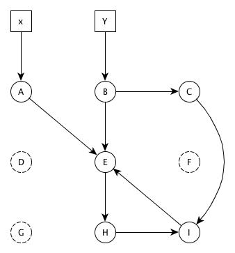

# 编译原理 第11次作业

**151220129 计科 吴政亿 wuzy.nju@gmail.com**

## 7.5.2

D,G,F,I的引用计数减1，H的引用计数减2,D,F,G的引用次数等于0，因此被释放空间。

## 7.6.1

1. 初始化，将所有节点reached=0，代表所有点都无法到达。
2. A,B作为根节点，将A.reached=1, B.reached=1。  
3. unscanned=[A,B] E.reached=1
4. unscanned=[B,E] C.reached=1
5. unscanned=[E,C] H.reached=1
6. unscanned=[C,H] I.reached=1
7. unscanned=[H,I]
8. unscanned=[I]
9. unscanned=[]
10. 由于DFG的reached=0，将D,F,G空间释放



## 8.2.2

1. 
```
LD      R1,i
MUL     R1,R1,#4
LD      R2,a(R1)
ST      x,R2
LD      R3,j
MUL     R3,R3,#4
LD      R4,b(R3)
ST      y,R4
ST      a(R1),R4
ST      b(R3),R2
```

2. 

```
LD      R1,i
MUL     R1,R1,#4
LD      R2,a(R1)
ST      x,R2
LD      R1,b(R1)
ST      y,R1
MUL     R1,R2,R1
ST      z,R1
```

## 8.2.4

```
    LD      R1,x
    LD      R2,y
    SUB     R1,R1,R2
    BLTZ    R1,L1
    LD      R1,#0
    ST      z,R1
    BR      L2
L1: LD      R1,#1
    ST      z,R1
```